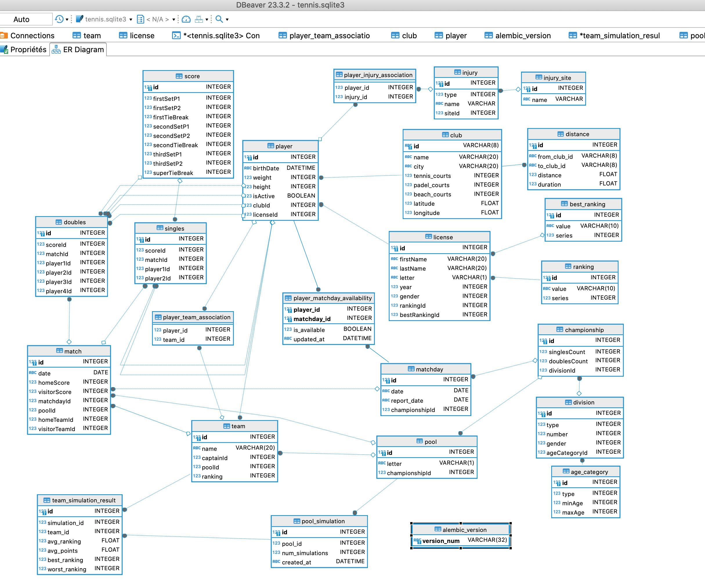

# TennisManager

Une application web pour la gestion des clubs de tennis, des championnats par équipes et la gestion des joueurs. Développée en Python, cette application aide les clubs de tennis dans :

Fonctionnalités principales :
- Gestion des clubs (USC Tennis comme club par défaut)
- Gestion des licences joueurs
- Création et gestion des équipes
- Organisation des championnats par saison
  - Gestion des catégories d'âge et divisions
  - Attribution des poules aux équipes
  - Gestion du calendrier des rencontres
  - Suivi des disponibilités des joueurs
- Fonctions administratives
  - Support multi-clubs
  - Gestion des mutations de joueurs
  - Gestion du poids des équipes par division

Stack technique :
- Python
- Flask
- SQLAlchemy ORM
- Mapbox GL JS pour les services de localisation

L'application est actuellement hébergée sur pythonanywhere et fournit une solution complète pour les administrateurs de clubs de tennis afin de gérer efficacement leurs opérations.

https://godot70.pythonanywhere.com

### TODOS
- [x] Création Club par défaut (USC Tennis)
- [x] Création des joueurs licenciés
- [x] Création d'une équipe à partir de joueurs au statut 'disponible'
- [ ] Création du championnat par équipes pour une saison donnée (date rencontres, format championnat, feuilles de match, etc...)
  - [x] ajout formulaire de création des championnats (vs catégorie d'âge et division)
  - [x] Création d'une équipe associée au championnat à partir des joueurs du club
  - [x] Assignation de l'équipe créée à un championnat via la poule communiquée par la ligue
  - [x] Création du calendrier prévisionnel du championnat (identique presque chaque année) et journées de championnat
  - [ ] Formulaire d'ajout des équipes adverses présentes dans la poule et du planning des rencontres pour l'équipe (domicile/extérieur/exempt) (utilisé après envoi par la ligue du calendrier des rencontres)
  - [x] Ajout formulaire modification calendrier (pour synchroniser avec celui fourni par la ligue)
  - [x] Gestion des disponibilités joueurs
- [ ] Administration:
  - [ ] Ajout club
    - [x] Ajout à partir des clubs listés en dur dans config.py (et 2 fichiers joueurs/joueuses présents dans static/data)
    - [ ] Faire formulaires d'ajout club et joueurs à partir de fichiers csv
  - [x] Suppression club
  - [x] Changement club
- [ ] Définition des poids min/max d'équipe pour la création des équipes à une division donnée.

* https://supports.uptime-formation.fr/03-python/partie-3/cours-3/16-stockage-de-donn%C3%A9es-et-orm/
* https://docs.sqlalchemy.org/en/20/orm/join_conditions.html#relationship-foreign-keys
* https://docs.sqlalchemy.org/en/13/orm/mapped_sql_expr.html#mapper-sql-expressions
* https://realpython.com/flask-blueprint/
* https://github.com/ryuichi-sumida/algorithm_for_round_robin_tournament
* https://docs.mapbox.com/mapbox-gl-js/example/setstyle/
* https://account.mapbox.com/
* https://tennisabstract.com/reports/atp_elo_ratings.html
* https://www.physio-pedia.com/Sport_Injury_Classification
* https://www.betterhealth.vic.gov.au/health/healthyliving/sports-injuries
* https://www.compart.com/fr/unicode/U+1F3E5
